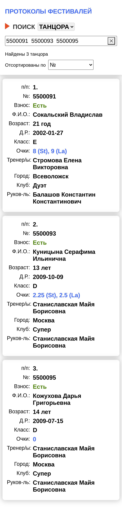

# asto

asto.dance implementation

[Демо](https://asto.dance/demo)

## Что есть?

Есть ассоциация бального танца, в которой состоят руководители и тренеры клубов, танцоры которых принимают участие в соревнованиях, организуемых под эгидой этой ассоциации

## Что надо?

Организовать хранение и доступ к данным танцоров, судей, тренеров и клубов для целей учета результатов, показанных на соревнованиях

Требуется создать web-интерфейс доступа к этим данным с набором актуальных фильтров. Список актуальных фильтров заранее не известен и выявляется в процессе эксплуатации системы (по мере возникновения потребности)

## Ограничения

Надо предусмотреть ситуацию возможжнго пользования продуктом в ситуации нестабильного интернета

Один из сценариев (назовем его "кассир") использования продукта:
- кассир, принимающий оплату за регистрацию на соревнование, предоставляет скидки танцорам, представляющим клубы, тренеры которых являются членами ассоциации (в соревнованиях могут принимать участие танцоры из любых других клубов)
- для этого у кассира должна быть возможность быстро определить, есть зарегистрирован ли танцор в базе ассоциации и уплачен ли им взнос за текущий год

Для поддержки этого сценария нужно: 
- обеспечить простоту поиска танцора в базе
- обеспечить работу продукта в ситуации, когда во время его работы пропадает интернет. То есть, если приложение загрузилось и начало работу, то дальнейшие перебои с интернетом не должны на него влиять 

А также ситуацию, когда в базу данных на сервере вносятся изменения, такие изменения должны быть доставлены на клиента без необходимости совершения клиентом каких-либо активных действий (Refresh-страницы)

Количество одновременных пользователей системы исчисляется не более, чем десятками

Интерфейс должен быть максимально простым с упором на использование на мобильных устройствах

## Архтектура

### Хранение 

Данные будем хранить в СУБД [Postgresql](https://www.postgresql.org/) 

Для работы с СУБД выберем crate [sqlx](https://crates.io/crates/sqlx), [не использующий концепцию ORM](https://www.yegor256.com/2014/12/01/orm-offensive-anti-pattern.html), но поддерживающий [проверку валидности SQL-запросов во время компиляции](https://github.com/launchbadge/sqlx/tree/main/sqlx-cli#force-building-in-offline-mode) вместе с [offline-режимом](https://github.com/launchbadge/sqlx/tree/main/sqlx-cli#force-building-in-offline-mode)

Изоляцию структуры базы данных от прикладной логики приложения обеспечим использованием хранимых на сервере процедур и фукнций. То есть прикладная логика не будет непосредственно обращаться к таблицам в СУБД, но только лишь через хранимые на сервере процедуры и функции

### Интерфейс

Предусмотрим одно поле ввода:

Подсказки при вводе:

Вывод результата:

Предусмотрим возможность показа сразу нескольких танцоров по их номерам (при "множественном показе" предусмотрим возможность сортировки списка по разным атрибутам):

Более сложные фильтры реализуем с использование хеш-тегов (например, "все танцоры клуба "ДК Прожектор"):

или "все танцора клуба "ДК Прожектор", имеющие танцевальный класс "D":

Систему хеш-тегов, а не визуальных фильтров используем намеренно, чтобы:
- сохранять интерфейс простым для самого распространенного сценария ("*найти танцора по фамилии или номеру*")
- оставить возможность расширенного поиска "для посвященных" (круг аудитории, которой нужны сложные запросы к базе, очень узок)
- иметь возможность расширять поисковые возможности (добавлять поддержку все новых хеш-тегов и логик) без необходимости усложнять интерфейс пользователя

### Offline

Для возможности продолжения работы с веб-приложением в режиме offline будем в момент загрузки приложения передавать с сервера все данные:
- во-первых, в нормализованном виде, как они хранятся в СУБД
- во-вторых, в бинарном формате (bincode)
- в-третьих, используя сжатие (gzip)

В таком виде вся база (за исключением протоколов турниров) небольшой ассоциации умещается в 47 КБайт. Эти 47 КБайт данных мы при старте веб-приложения передаем с сервера на клиент, и более клиент не нуждается в данных с сервера для продолжения своей работы (речь идёт о поддержке сценария "кассир"). Таким образом, используя CSR (client side rendering) может продолжать работу в offline-режиме

При этом offline-режим не распространяется на раздел "Протоколы фестивалей", поскольку:
- протоколы фестивалей не нужны для сценария "кассир", где критичен offline
- для обеспечения работы протоколов в offline-режиме пришлось бы передавать значительно бОльший объем данных

### Websocket

Для возможности передачи изменений в базе в веб-интерфейс клиента без необходимости активных действий со стороны пользователя будем использовать [websocket](https://caniuse.com/mdn-api_websocket)

## Программные компоненты и детали реализации

Код разбит на [несколько crate'ов](https://github.com/yurybikuzin/asto_dance/tree/main/src/rust) и оформлен в виде [Cargo Workspace](https://doc.rust-lang.org/book/ch14-03-cargo-workspaces.html)

### asto_back

Сервер написан на Rust с использованием библиотек:
- [tokio](https://crates.io/crates/tokio) - как async-runtime
- [warp](https://crates.io/crates/warp) - для реализации web(socket)-сервера

Компилируется с указанием `--target x86_64-unknown-linux-musl` для статической линковки всех (возможно) необходимых библиотек. В результате получается standalone монолит 20MB, не нуждающийся в динамических зависимостях. Что упрощает процедуру деплоя

Во время эксплуатации asto_back запускается как systemd-сервис и размещается за [реверсиным прокси Nginx](https://docs.nginx.com/nginx/admin-guide/web-server/reverse-proxy/), который также берёт на себя работу с SSL-сертификатами, избавляя web(socket)-сервер ipado3_back от необходимости реализации этой функциональности

### asto_front

Клиент написан на Rust с использование реактивной библиотеки [dominator](https://crates.io/crates/dominator) для реализации CSR (client side rendering)

Компилируется в WASM (gzip len 786K), кроме части, обеспечивающей раздел "Протокол фестивалей". Эта часть, поскольку не предполагает интерактивного взаимодействия с пользователем (не считая навигации), реализована как SSR (server side rendered), страницы для которой генерриуются asto_back при помощи библиотеки [maud](https://docs.rs/maud/0.25.0/maud/)

Работает в [браузере клиента](https://caniuse.com/wasm)

### asto_db

Rust-библиотека, используемая asto_back. Содержит функции, являющиеся для asto_back интерфейсом для взаимодействия с СУБД Postgresql

### asto_common

Rust-библиотека, используемая asto_back, asto_front, asto_db. Содержит описания структур данных общих для всех программных компонент, в частности структур websocket-сообщений

